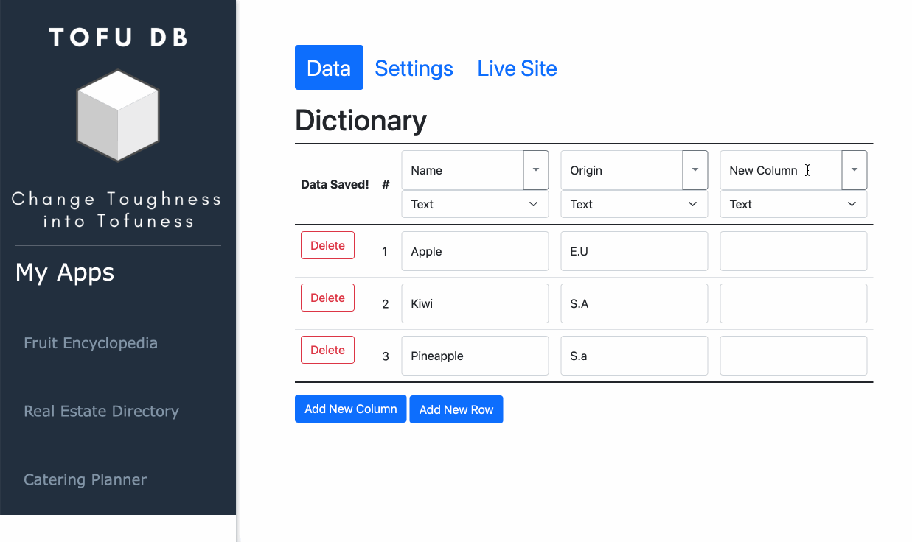
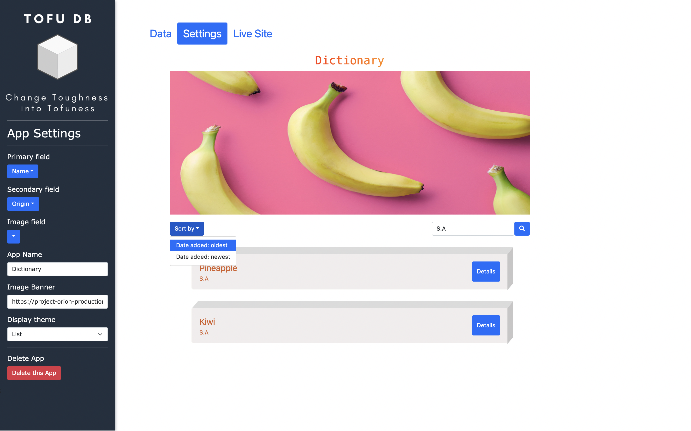
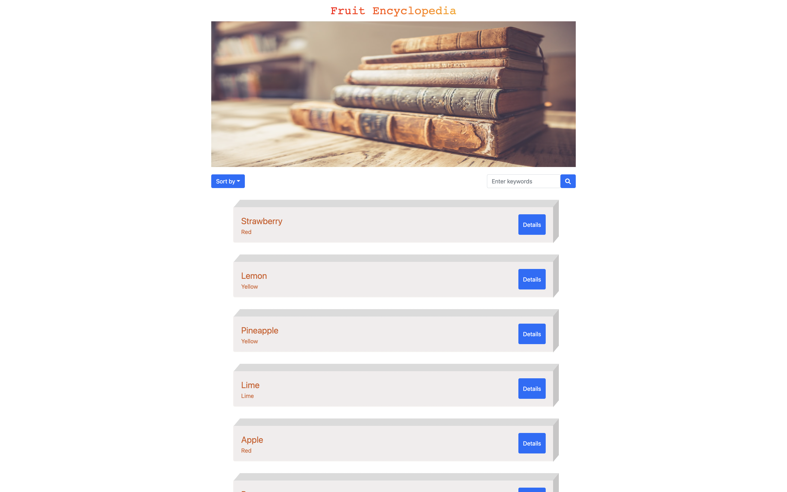
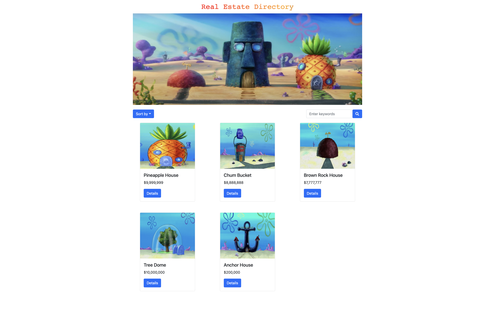
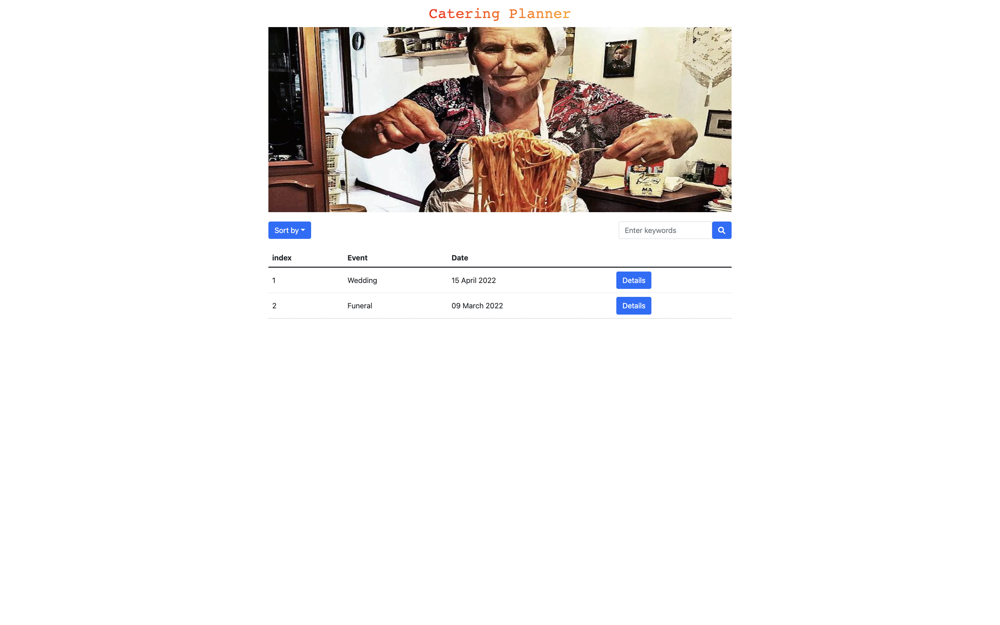

# Tofu DB

## Project overview

TofuDB is a customizable database builder with an interactive UI based on Ruby on Rails and React. We made this for users who want to create their own simple database driven website, allow them to manage database structure and control how the data is presented. No coding needed!

## Getting started

Install dependencies on the Client Server:

```sh
npm install
```

Running Webpack Development Server:

```sh
npm start
```

we'll need to run both Client Server and Api Server to get our application working. For installation Api Server, please head over to README file of https://github.com/tsun812/tofu_db_api

After both servers are installed and running, you should be able to view Tofu DB in http://localhost:8000/

## Feature

#### Database UI

User could dynamically generate database based on their need.

- Create/modify/delete row
- Create/modify/delete column
- Create/modify/delete cell value



#### Settings panel

Preview of app with customizable settings where user could decide how the data is presented:

- Modify app name/header
- Add/modify image banner
- Sort/filter results
- Change display themes

<b >Settings panel overview</b>


<b>Details page contains data related to this specific item.</b>


<b>Sort by dates, filter by keywords</b>



## General applications

</br> 

</br>



